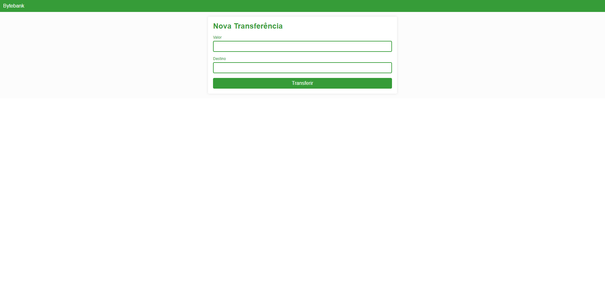

# Desktop

<h1 align="center">
    
</h1>

<br>

<h1 align="center">
    
</h1>

<br>

## 🧪 Technologies

This project was developed using the following technologies:

- [Angular](https://angular.io/)
- [JSON Server](https://github.com/typicode/json-server)

## 🚀 Getting started

Run this command to install and run the dependencies.

```bash
npm install

ng serve

json-server --watch db.json      // Inside the dados folder
```
## 📝 License

This project is licensed under the MIT License. See the [LICENSE](LICENSE) file for details.

---

Made with 💜 by [TiagoTNX](https://github.com/TiagoTNX) 👋
